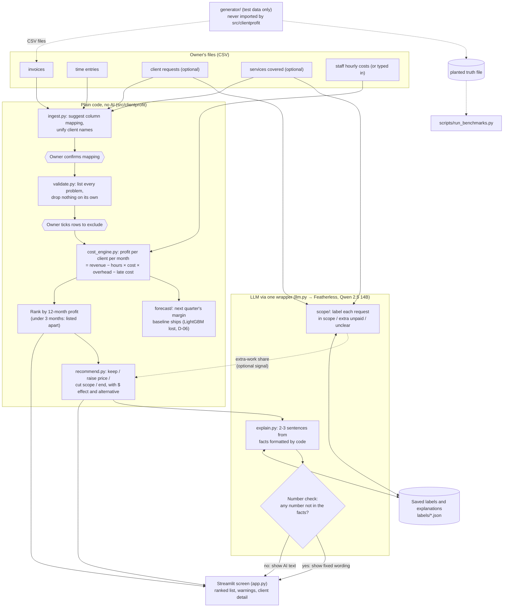

# Architecture

GitHub shows this diagram as a picture. For the Devpost upload, take a
screenshot of it on GitHub, or paste the code block into https://mermaid.live
and export a PNG.

## Rules the diagram encodes

- **The ranked list never waits for the LLM.** It is shown as soon as the cost
  engine finishes (about 1 second for 50 clients). Labels and explanations fill
  in afterwards.
- **The LLM never does arithmetic.** Every number is computed and formatted by
  code. The LLM only chooses a label or writes words around given numbers.
- **One wrapper for the provider** (`src/clientprofit/llm.py`). Changing the
  provider is a config change.
- **If the LLM is down,** labels fall back to a keyword rule and explanations
  to fixed wording. After 5 failed calls in a row the app stops calling.
- **The generator is test equipment.** Product code never imports it. Only the
  benchmark script reads the planted truth. The app uses the generator only to
  build demo files when they are missing (D-28).
