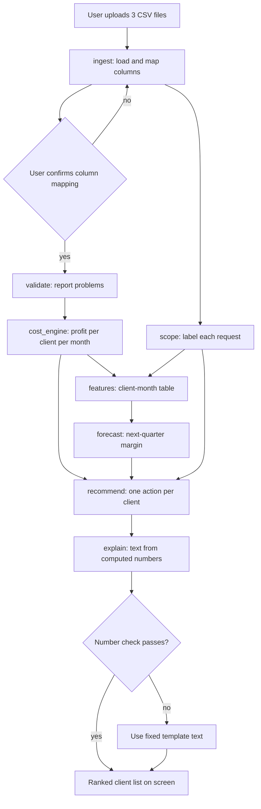

# Execution

How the code runs. This file must match the actual code at all times.

> **Current state: mostly PLANNED.** What exists on 2026-10-05: the schema
> (`src/clientprofit/schema.py`), a loader for schema-named files
> (`src/clientprofit/ingest.py`), the cost engine (`src/clientprofit/cost_engine.py`),
> the LLM wrapper (`src/clientprofit/llm.py`), the data generator (`generator/`),
> the hand-calculation files (`tests/fixtures/hand_calc/`) and the tests for them. Everything else below is still the target design and is marked `Planned`.
> When code for a section lands, replace its content with what the code
> really does and change the mark to `Verified on <date>`. A section may
> only be marked `Verified` after its commands were run and its function
> names were checked against the code.
>
> Sections 11 to 14 describe code that exists and are marked `Verified`.

## Keeping this file true

- A change to an entry point, a folder, a function listed here, a config key or a failure path is not finished until this file is updated in the same commit.
- Run `python scripts/gen_callgraph.py` after any code change. Run it with `--check` in CI so a stale call graph fails the build.
- Never describe a function, command or key that does not exist in the code.

## 1. Entry points (Planned)

| Purpose | Exact command |
|---|---|
| Install | `pip install -r requirements.txt` |
| Create generated data | `python scripts/generate_data.py --out data/generated --seed 42` (optional: `--truth data/truth`, `--clients 50`) |
| Run the app | `streamlit run app.py` |
| Run the pipeline with no screen | `python scripts/run_pipeline.py --data data/generated --out out/` |
| Run all benchmarks | `python scripts/run_benchmarks.py --data data/generated --out out/benchmarks.json` |
| Run tests | `pytest` |
| Regenerate the call graph | `python scripts/gen_callgraph.py` |
| Check the call graph is current | `python scripts/gen_callgraph.py --check` |

Verified on 2026-10-04: Install, Create generated data, Run tests, and both call-graph commands. The app, pipeline and benchmark commands do not exist yet.

## 2. Folder layout (Planned)

```
app.py                      Streamlit entry point: upload, ranked list, client detail
config.yaml                 All settings (see section 9). Not created yet
requirements.txt            Exists
pyproject.toml              Exists. Only holds pytest settings (src/ and . on the import path)
src/clientprofit/
    pipeline.py             run_pipeline(): calls every stage in order
    config.py               Loads and checks config.yaml
    schema.py               The fixed column names and types for the three inputs. Exists
    ingest.py               Loads CSV files, maps messy columns to the schema, unifies client names. Exists (section 14)
    validate.py             Finds missing clients, date gaps, bad values. Exists (section 14)
    cost_engine.py          Profit per client per month. Arithmetic only. Exists (section 14)
    features.py             Client-month features for the forecast
    recommend.py            Rules and simulation: one action per client
    explain.py              Plain-language text, plus the number check
    llm.py                  The only file that calls an LLM API. Exists (section 13)
    forecast/
        registry.py         Name -> forecaster
        baseline.py         Next quarter equals last quarter
        lightgbm_model.py   LightGBM forecaster
    scope/
        registry.py         Name -> detector
        keyword.py          Keyword baseline
        llm_detector.py     LLM-based detector
    datasets/
        registry.py         Name -> dataset loader
        generated.py        Loader for generated data
generator/                  Data generator. Never imported by src/clientprofit. Exists (section 11)
    params.py               All generator settings
    names.py                Client and staff names, task types
    world.py                Staff, clients, the clean tables, the planted true profit
    messages.py             Request message templates and the message bank loader
    messy.py                Planted data problems and the 10 header styles
    generate.py             generate(): writes the CSV files and the truth file
    message_bank.json       Request messages, paraphrased once by an LLM and saved. Not created yet
scripts/
    generate_data.py        Exists
    llm_smoke_test.py       Exists: times one model on 20 messages (section 13)
    run_pipeline.py
    run_benchmarks.py
    gen_callgraph.py        Exists and tested
tests/
    test_generator.py       Exists
    test_project_rules.py   Exists: no generator imports, call graph current, hand-calc headers
    test_llm.py             Exists: the LLM wrapper against a local fake server
    test_cost_engine.py     Exists: benchmark 1 and one test per calculation
    test_ingest_validate.py Exists: mapping, name cleaning, validation, planted problems found
    fixtures/hand_calc/     Benchmark 1 inputs, hand-calculated expected answers, and the workbook used
data/                       Input files. Not committed
    generated/              Written by scripts/generate_data.py
    truth/                  Truth files. Read only by the benchmark scripts
out/                        Results and benchmark numbers. Not committed
docs/
    decisions.md
    execution.md
    callgraph.md            Auto-generated. Do not edit. Exists
```

## 3. End-to-end flow (Planned)



## 4. Single-run walkthrough (Planned)

What happens when the owner uploads files and clicks Run:

1. `app.py` reads the three files and calls `pipeline.run_pipeline`.
2. `ingest` loads each file and proposes a mapping from the file's columns to the fixed schema.
3. The screen shows the mapping. The owner confirms or corrects it.
4. `validate` lists problems. Nothing is dropped without the owner seeing it.
5. `cost_engine` works out revenue, cost of hours and cost of late payment per client per month.
6. `app.py` shows the ranked list straight away. It uses no request labels (D-15). Benchmark 7 stops the clock here.
7. `scope` looks up saved labels by message text and labels the rest live, in parallel, with a progress indicator. Labelling is timed separately.
8. `features` builds the client-month table from steps 5 and 7.
9. `forecast` predicts next-quarter margin for each client with enough history.
10. `recommend` picks one action per client and works out its dollar effect.
11. `explain` writes two or three sentences per client and checks every number against the computed table.
12. The screen fills in labels, forecasts, recommendations and explanations as they arrive. Clicking a client shows the detail and the rows behind each figure.

## 5. Function call graph

- **Auto-generated graph:** `docs/callgraph.md`, written by `scripts/gen_callgraph.py` using pyan3. It covers `src/clientprofit` only, not `generator/`. Today it holds only `schema.py`, and pyan3 lists that module's constants as "calls".
- **Limit:** pyan3 reads the code without running it. Calls made through the registries (section 10) will not appear. They are listed by hand below.

### Main call chains, written by hand (Planned)

```
app.main
  -> pipeline.run_pipeline
       -> config.load_config
       -> ingest.load_inputs -> ingest.map_columns -> llm.complete
       -> validate.validate_inputs
       -> cost_engine.compute_client_month_profit
       -> scope.registry.get_detector -> <detector>.label_requests
       -> features.build_features
       -> forecast.registry.get_forecaster -> <forecaster>.fit / .predict
       -> recommend.recommend_actions
       -> explain.write_explanations -> llm.complete
                                     -> explain.check_numbers
```

## 6. Key functions reference (Planned)

| Function | Input | Output | Notes |
|---|---|---|---|
| `pipeline.run_pipeline` | paths, config | results object | The only function `app.py` and the scripts call |
| `ingest.map_columns` | raw table | mapping, confidence | Uses the LLM. Result needs user confirmation. Not built; `ingest.propose_mapping` (rule-based, section 14) is the fallback |
| `validate.validate_inputs` | tables, settings, merged names | list of problems | Never drops rows (section 14) |
| `cost_engine.compute_client_month_profit` | invoices, time entries, settings, requests | client-month table, invoices with costs, time entries with costs, as-of date | No LLM, no model. Fully tested (section 14) |
| `features.build_features` | profit table, request labels | feature table | Uses only data up to each month |
| `<forecaster>.fit` / `.predict` | feature table | next-quarter margin per client | Chosen by `forecast.model` in config |
| `<detector>.label_requests` | requests table | one label per request | Chosen by `scope.detector` in config |
| `recommend.recommend_actions` | profit, forecast, labels, config | one action per client with dollar effect | Rules, not a model |
| `explain.write_explanations` | computed tables | text per client | Receives numbers, never computes them |
| `explain.check_numbers` | text, computed tables | pass or fail | A fail triggers the template text |
| `llm.complete` | prompt | text | The single place an LLM API is called |

## 7. Data flow (Planned)

| Stage | Reads | Writes |
|---|---|---|
| ingest | `invoices.csv`, `time_entries.csv`, `requests.csv` | three tables in the fixed schema |
| validate | three tables | problem list |
| cost_engine | invoices, time entries, staff costs from config | `client_month_profit` |
| scope | requests | `request_labels` |
| features | `client_month_profit`, `request_labels` | `client_month_features` |
| forecast | `client_month_features` | `margin_forecast` |
| recommend | `client_month_profit`, `margin_forecast`, `request_labels` | `recommendations` |
| explain | `recommendations` and the tables behind it | `explanations` |
| benchmarks | all of the above, plus the generator's truth file | `out/benchmarks.json` |

The generator's truth file (`data/truth/truth_seed<seed>.json`) is read only by `scripts/run_benchmarks.py`.

## 8. Failure paths (Planned)

| What goes wrong | Where | What the code does | What the user sees |
|---|---|---|---|
| A required column cannot be mapped | ingest | Stops | The mapping screen, with the missing column marked |
| LLM call fails during column mapping | ingest | Falls back to `propose_mapping` | The suggested mapping, to confirm or correct by hand |
| A required column is not mapped | ingest | `missing_required` lists it; the run cannot start | The mapping screen with the missing column named |
| A staff member has no hourly cost | cost_engine | Stops with `CostEngineError` naming the staff | The name of the staff member and where to set the cost |
| A required value is empty or unreadable (client, dates, amount, staff, hours) | cost_engine | Stops with `CostEngineError` listing the row numbers | The rows to fix or exclude in the validation step |
| Negative or zero hours | validate | Keeps the rows, lists them | The rows, with a choice to exclude them |
| Client has hours but no invoices | validate | Keeps the client, flags it | Client shown as all cost, with a warning |
| Client has under 3 months of data | cost_engine, forecast | Computes profit, skips forecast and ranking | Client listed apart as "not enough history" |
| Forecast model fails or is not available | forecast | Uses the baseline | A note that the baseline was used |
| LLM call fails during request labelling | scope | Uses the keyword detector | A note that the simpler detector was used |
| Labelling still running | scope | Ranked list already shown; labels fill in as they finish | A progress indicator; scope-creep figures and "cut scope" marked as pending |
| LLM call fails during explanation | explain | Uses fixed template text | Plain template text |
| Number check finds a number not in the tables | explain | Discards the text, uses the template | Plain template text |
| Config key missing or wrong type | config | Stops at start-up | The key name and the expected type |

## 9. Configuration reference (Planned)

All settings live in `config.yaml`. The defaults below are placeholders chosen
for a first run. The generator does not read `config.yaml`: its own settings are
in `generator/params.py`, and its seed comes from `--seed`. The hand-calculation
check has its own `tests/fixtures/hand_calc/config.yaml`. They are not based on any real agency's figures.

| Key | Meaning | Placeholder default |
|---|---|---|
| `staff_costs` | Hourly cost per staff member | none; must be given |
| `overhead_multiplier` | Factor applied to the cost of hours to cover overhead | 1.3 |
| `target_margin` | Margin a client should reach | 0.30 |
| `late_payment_annual_rate` | Yearly cost of money tied up in unpaid invoices | 0.08 |
| `payment_terms_days` | Days a client has to pay before an invoice counts as late | 30 |
| `unpaid_warning_days` | Days past due before an unpaid invoice gets a warning flag | 90 |
| `min_months_for_ranking` | History needed before a client is ranked | 3 |
| `forecast.model` | Forecaster name from the registry | `baseline` |
| `forecast.horizon_months` | How far ahead to predict | 3 |
| `forecast.test_months` | Months held back for benchmark 3 | 6 |
| `scope.detector` | Detector name from the registry | `keyword` |
| `llm.provider` | LLM provider used by `llm.py`. Known: `featherless` | `featherless` (D-14) |
| `llm.model` | Model name passed to the provider | `Qwen/Qwen2.5-14B-Instruct` (D-14) |
| `dataset` | Dataset loader name from the registry | `generated` |
| `random_seed` | Seed for the generator and the model | 42 |

## 10. How to add a new algorithm or dataset (Planned)

### New forecast algorithm

1. Add a file in `src/clientprofit/forecast/` with a class that has `fit(features)` and `predict(features)`.
2. Register it under a name in `forecast/registry.py`.
3. Set `forecast.model` in `config.yaml` to that name.
4. Run `python scripts/run_benchmarks.py` and compare with the baseline.
5. Add an entry to `docs/decisions.md` with the measured result.
6. Add the class to section 6 and the registry call to section 5 of this file.
7. Run `python scripts/gen_callgraph.py`.

### New scope-creep detector

Same steps, in `src/clientprofit/scope/`, with a class that has `label_requests(requests)`, and the config key `scope.detector`.

### New dataset

1. Add a loader in `src/clientprofit/datasets/` that returns the three tables in the fixed schema from `schema.py`.
2. Register it under a name in `datasets/registry.py`.
3. Set `dataset` in `config.yaml` to that name.
4. If the dataset has no truth file, benchmarks 2 and 3 cannot be scored on it. Say so in the benchmark output.
5. Add an entry to `docs/decisions.md`, then update sections 2 and 7 of this file.

## 11. Data generator (Verified on 2026-10-04)

Command: `python scripts/generate_data.py --out data/generated --seed 42`.
Same seed, same files. Takes about 8 seconds for 50 clients. Design: D-12 as changed by D-13 and D-17.
Services and message wording use a second random stream (`default_rng([seed, 1])`), so they do not change the planted profits.

| Function | File | What it does |
|---|---|---|
| `generate(seed, n_clients, out_dir, truth_dir)` | `generator/generate.py` | Runs every step below and writes all files. Refuses `n_clients` outside 40-60 |
| `make_staff` | `generator/world.py` | 12 staff plus the new hire, with hourly costs |
| `make_holidays` | `generator/world.py` | Two holiday months a year per staff member |
| `make_clients` | `generator/world.py` | Clients with planted types, later type changes, repricing, joining and leaving, payment habits |
| `simulate` | `generator/world.py` | Clean invoices, time entries and requests month by month, with spells, seasons, holidays, the staff change and one-off projects |
| `client_events` | `generator/world.py` | Each client's planted changes by month, for the truth file |
| `assign_services` | `generator/world.py` | Gives each client 3 to 5 covered items (D-17) |
| `services_text` | `generator/world.py` | A client's services as one line of text |
| `add_messages` | `generator/world.py` | Adds message text to each request; in-scope messages name covered items, extra work names uncovered items (D-17) |
| `truth_profit` | `generator/world.py` | Planted true profit per client per month, using the D-11 rules |
| `load_bank`, `make_message` | `generator/messages.py` | Message bank if present, otherwise templates |
| `plant_defects` | `generator/messy.py` | Adds the planted data problems and lists them |
| `write_style` | `generator/messy.py` | Writes the three tables in one header style and returns the true mapping |

Files written:

| File | Contents |
|---|---|
| `<out>/invoices.csv`, `time_entries.csv`, `requests.csv` | Main files, "title" header style, with planted problems |
| `<out>/staff_costs.csv` | Staff name and hourly cost, for the settings screen. Includes the new hire |
| `<out>/clients.csv` | Optional fourth input: `Client`, `Services Covered` (D-17) |
| `<out>/header_variants/<style>/*.csv` | The same data in each of the 10 header styles (benchmark 5) |
| `<out>/label_sheet.csv` | 150 messages, 50 per generator label, with the client's services; label column blank (benchmark 4) |
| `<truth>/truth_seed<seed>.json` | Client types, services covered, each client's planted changes by month, agency-wide events, true monthly profit, loss-making labels, request labels by row, header mappings, planted problems, message source |

Failure paths: `n_clients` outside 40-60 raises `ValueError`. No other checks.

## 12. Tests (Verified on 2026-10-05)

`pytest` runs `tests/test_generator.py`, `tests/test_project_rules.py`, `tests/test_llm.py` and `tests/test_cost_engine.py`.
`test_project_rules.py` runs `python scripts/gen_callgraph.py --check`, so a
stale call graph fails the test run. It also fails if any file in
`src/clientprofit` imports `generator`.

## 13. LLM wrapper (Verified on 2026-10-05)

Checked against Featherless with `Qwen/Qwen2.5-14B-Instruct` and against a
local fake server (`tests/test_llm.py`).

| Function | What it does |
|---|---|
| `llm.complete(prompt, model, provider="featherless", system=None, max_tokens=256, temperature=0.0)` | Sends one chat request, returns the reply text |
| `llm.list_models(provider="featherless")` | Returns the model ids the provider offers |

- Key: read from the environment variable named in `PROVIDERS` (`FEATHERLESS_API_KEY`). Never in code or config. If it is not set, `PLACEHOLDER_KEY` is sent; in the build environment a proxy swaps in the real key.
- Every request sends `User-Agent: clientprofit/0.1`. Cloudflare in front of Featherless blocks Python's default user agent with HTTP 403 (error 1010).
- `LLM_BASE_URL` overrides the provider's address. Only the tests use it.
- Retries: HTTP 429, 500, 502, 503, 504 and connection errors are retried 3 times, waiting 1, 2 and 4 seconds.
- Failure path: an unknown provider, a refused key (HTTP 401/403, message names the variable and shows the server's reply), a failed call or an unexpected reply raises `LLMError`. Callers must catch it and use their non-LLM fallback (section 8).

Smoke test: `python scripts/llm_smoke_test.py --list-models`, then
`python scripts/llm_smoke_test.py --model <model id>`. It takes 20 messages from
`data/generated/label_sheet.csv`, times each call, and writes
`out/llm_smoke_<model>.json` with timings, replies, parsed labels and failures.
It does not read the truth file.

## 14. Loader, validation and cost engine (Verified on 2026-10-05)

Benchmark 1 passes: `pytest tests/test_cost_engine.py` matches the
hand-calculated files in `tests/fixtures/hand_calc/` exactly.

| Function | File | What it does |
|---|---|---|
| `read_raw(path)` | `ingest.py` | Reads a CSV as text, nothing typed yet |
| `propose_mapping(headers, table)` | `ingest.py` | Suggests `{header: schema column or None}` from `SYNONYMS` (D-19). The owner confirms |
| `missing_required(mapping, table)` | `ingest.py` | Required schema columns the mapping does not cover |
| `apply_mapping(raw, mapping, table, src_file)` | `ingest.py` | Renames confirmed columns and types them; unmapped columns are ignored |
| `client_key(name)` | `ingest.py` | Name used to match clients (D-19) |
| `unify_client_names(tables)` | `ingest.py` | One display name per client; keeps `client_original`; returns the merges |
| `validate_inputs(tables, settings=None, merged_names=None)` | `validate.py` | Problems with severity, table, `_src_row` numbers, message and `suggest_exclude`. Changes nothing |
| `exclude_rows(tables, exclusions)` | `validate.py` | Removes only the rows the owner chose |
| `has_errors(problems)`, `summary(problems)` | `validate.py` | Any error? / problems as a table |
| `load_canonical(folder)` | `ingest.py` | Reads `invoices.csv`, `time_entries.csv`, `requests.csv` whose headers already match the schema |
| `coerce_types(df, table, src_file)` | `ingest.py` | Gives each schema column its type; adds `_src_file` and `_src_row` (spreadsheet row number, header = 1). Unreadable values and blank text become empty; no row is dropped |
| `as_of_date(invoices, time_entries, requests=None)` | `cost_engine.py` | Latest invoice, paid, work or request date (D-18) |
| `invoice_costs(invoices, settings, as_of)` | `cost_engine.py` | Due date, days late, late cost, month, overdue-unpaid flag per invoice |
| `labour_costs(time_entries, settings)` | `cost_engine.py` | Hours x hourly cost x `overhead_multiplier` per time entry |
| `compute_client_month_profit(invoices, time_entries, settings, requests=None)` | `cost_engine.py` | Revenue, labour cost, late cost, profit, margin (empty when revenue is 0), and the `_src_row` numbers behind each client-month |
| `compute_client_totals(client_month, invoices_with_costs, settings, as_of)` | `cost_engine.py` | Months of data, 12-month revenue, profit and margin, `profit_if_overdue_unpaid` (D-16), ranked, loss-making |
| `rank_clients(totals)` | `cost_engine.py` | Ranked clients by 12-month profit, and unranked clients apart |

Settings used: `staff_costs`, `overhead_multiplier`, `late_payment_annual_rate`,
`payment_terms_days`, `unpaid_warning_days`, `min_months_for_ranking`.
They are passed in as a dictionary; `config.py` does not exist yet.

Validation checks: unreadable required values (error), staff without a cost
(error), zero or negative hours, invoices paid before issue, negative amounts,
duplicate rows, hours but no invoices, requests from unknown clients, months
with hours but no invoice (warnings), empty optional values, invoices but no
hours and merged name spellings (info). The engine stops on unreadable values,
so errors must be fixed or excluded first.
